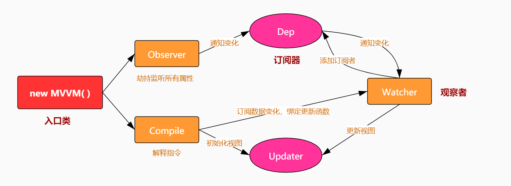

# copyVue

- 实现一个指令解析器  Compile
- 实现一个数据监听器  Observer
- 实现一个watcher去更新视图
- 实现一个proxy

---------

Vue 是采用数据劫持配合发布者-订阅者模式的方法,通过
`Object.definerProperty()` 来劫持各个属性的setter和getter,
在数据变动时,发布消息给依赖收集器,去通知观察者,做出对应的回调函数,然后更新视图

MVVM 作为绑定的入口,整合了Observer(劫持并监听各个属性),Compile 和 Watcher三者 
通过Observer 监听model数据变化,通过Compile来解析编译模板指令,最终利用Watcher搭起了
Observer和Compile之间的通信桥梁,达到数据变化 => 视图更新;视图交互变化 => 数据model变更的双向绑定效果